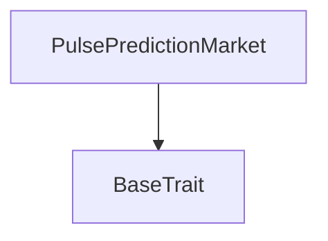

# Tact compilation report
Contract: PulsePredictionMarket
BoC Size: 1101 bytes

## Structures (Structs and Messages)
Total structures: 16

### DataSize
TL-B: `_ cells:int257 bits:int257 refs:int257 = DataSize`
Signature: `DataSize{cells:int257,bits:int257,refs:int257}`

### SignedBundle
TL-B: `_ signature:fixed_bytes64 signedData:remainder<slice> = SignedBundle`
Signature: `SignedBundle{signature:fixed_bytes64,signedData:remainder<slice>}`

### StateInit
TL-B: `_ code:^cell data:^cell = StateInit`
Signature: `StateInit{code:^cell,data:^cell}`

### Context
TL-B: `_ bounceable:bool sender:address value:int257 raw:^slice = Context`
Signature: `Context{bounceable:bool,sender:address,value:int257,raw:^slice}`

### SendParameters
TL-B: `_ mode:int257 body:Maybe ^cell code:Maybe ^cell data:Maybe ^cell value:int257 to:address bounce:bool = SendParameters`
Signature: `SendParameters{mode:int257,body:Maybe ^cell,code:Maybe ^cell,data:Maybe ^cell,value:int257,to:address,bounce:bool}`

### MessageParameters
TL-B: `_ mode:int257 body:Maybe ^cell value:int257 to:address bounce:bool = MessageParameters`
Signature: `MessageParameters{mode:int257,body:Maybe ^cell,value:int257,to:address,bounce:bool}`

### DeployParameters
TL-B: `_ mode:int257 body:Maybe ^cell value:int257 bounce:bool init:StateInit{code:^cell,data:^cell} = DeployParameters`
Signature: `DeployParameters{mode:int257,body:Maybe ^cell,value:int257,bounce:bool,init:StateInit{code:^cell,data:^cell}}`

### StdAddress
TL-B: `_ workchain:int8 address:uint256 = StdAddress`
Signature: `StdAddress{workchain:int8,address:uint256}`

### VarAddress
TL-B: `_ workchain:int32 address:^slice = VarAddress`
Signature: `VarAddress{workchain:int32,address:^slice}`

### BasechainAddress
TL-B: `_ hash:Maybe int257 = BasechainAddress`
Signature: `BasechainAddress{hash:Maybe int257}`

### PlaceBet
TL-B: `place_bet#50554231 marketId:^string marketLabel:^string direction:uint8 = PlaceBet`
Signature: `PlaceBet{marketId:^string,marketLabel:^string,direction:uint8}`

### CloseRound
TL-B: `close_round#50554331 marketId:^string = CloseRound`
Signature: `CloseRound{marketId:^string}`

### SettleRound
TL-B: `settle_round#50555331 marketId:^string result:uint8 = SettleRound`
Signature: `SettleRound{marketId:^string,result:uint8}`

### Claim
TL-B: `claim#50555031 marketId:^string = Claim`
Signature: `Claim{marketId:^string}`

### Position
TL-B: `_ upStake:coins downStake:coins claimed:bool = Position`
Signature: `Position{upStake:coins,downStake:coins,claimed:bool}`

### PulsePredictionMarket$Data
TL-B: `_ admin:address roundDurationSeconds:int257 protocolFeeBps:int257 deploymentNonce:int257 marketId:^string marketLabel:^string status:int257 openedAt:int257 closesAt:int257 settledAt:int257 totalUp:coins totalDown:coins result:int257 positions:dict<address, ^Position{upStake:coins,downStake:coins,claimed:bool}> = PulsePredictionMarket`
Signature: `PulsePredictionMarket{admin:address,roundDurationSeconds:int257,protocolFeeBps:int257,deploymentNonce:int257,marketId:^string,marketLabel:^string,status:int257,openedAt:int257,closesAt:int257,settledAt:int257,totalUp:coins,totalDown:coins,result:int257,positions:dict<address, ^Position{upStake:coins,downStake:coins,claimed:bool}>}`

## Get methods
Total get methods: 0

## Exit codes
* 2: Stack underflow
* 3: Stack overflow
* 4: Integer overflow
* 5: Integer out of expected range
* 6: Invalid opcode
* 7: Type check error
* 8: Cell overflow
* 9: Cell underflow
* 10: Dictionary error
* 11: 'Unknown' error
* 12: Fatal error
* 13: Out of gas error
* 14: Virtualization error
* 32: Action list is invalid
* 33: Action list is too long
* 34: Action is invalid or not supported
* 35: Invalid source address in outbound message
* 36: Invalid destination address in outbound message
* 37: Not enough Toncoin
* 38: Not enough extra currencies
* 39: Outbound message does not fit into a cell after rewriting
* 40: Cannot process a message
* 41: Library reference is null
* 42: Library change action error
* 43: Exceeded maximum number of cells in the library or the maximum depth of the Merkle tree
* 50: Account state size exceeded limits
* 128: Null reference exception
* 129: Invalid serialization prefix
* 130: Invalid incoming message
* 131: Constraints error
* 132: Access denied
* 133: Contract stopped
* 134: Invalid argument
* 135: Code of a contract was not found
* 136: Invalid standard address
* 138: Not a basechain address
* 15520: round_closed
* 19900: position_not_found
* 32385: round_not_open
* 32630: stake_required
* 35659: round_not_found
* 36840: another_round_active
* 45634: already_claimed
* 45775: no_winning_position
* 47541: admin_only
* 55144: round_expired
* 59719: round_not_closed
* 61822: round_not_settled
* 63018: invalid_winner_pool

## Trait inheritance diagram

## Contract dependency diagram

