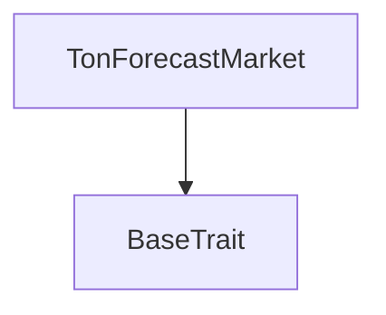
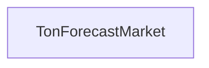

# Tact compilation report
Contract: TonForecastMarket
BoC Size: 2286 bytes

## Structures (Structs and Messages)
Total structures: 19

### DataSize
TL-B: `_ cells:int257 bits:int257 refs:int257 = DataSize`
Signature: `DataSize{cells:int257,bits:int257,refs:int257}`

### SignedBundle
TL-B: `_ signature:fixed_bytes64 signedData:remainder<slice> = SignedBundle`
Signature: `SignedBundle{signature:fixed_bytes64,signedData:remainder<slice>}`

### StateInit
TL-B: `_ code:^cell data:^cell = StateInit`
Signature: `StateInit{code:^cell,data:^cell}`

### Context
TL-B: `_ bounceable:bool sender:address value:int257 raw:^slice = Context`
Signature: `Context{bounceable:bool,sender:address,value:int257,raw:^slice}`

### SendParameters
TL-B: `_ mode:int257 body:Maybe ^cell code:Maybe ^cell data:Maybe ^cell value:int257 to:address bounce:bool = SendParameters`
Signature: `SendParameters{mode:int257,body:Maybe ^cell,code:Maybe ^cell,data:Maybe ^cell,value:int257,to:address,bounce:bool}`

### MessageParameters
TL-B: `_ mode:int257 body:Maybe ^cell value:int257 to:address bounce:bool = MessageParameters`
Signature: `MessageParameters{mode:int257,body:Maybe ^cell,value:int257,to:address,bounce:bool}`

### DeployParameters
TL-B: `_ mode:int257 body:Maybe ^cell value:int257 bounce:bool init:StateInit{code:^cell,data:^cell} = DeployParameters`
Signature: `DeployParameters{mode:int257,body:Maybe ^cell,value:int257,bounce:bool,init:StateInit{code:^cell,data:^cell}}`

### StdAddress
TL-B: `_ workchain:int8 address:uint256 = StdAddress`
Signature: `StdAddress{workchain:int8,address:uint256}`

### VarAddress
TL-B: `_ workchain:int32 address:^slice = VarAddress`
Signature: `VarAddress{workchain:int32,address:^slice}`

### BasechainAddress
TL-B: `_ hash:Maybe int257 = BasechainAddress`
Signature: `BasechainAddress{hash:Maybe int257}`

### BetYes
TL-B: `bet_yes#54465931  = BetYes`
Signature: `BetYes{}`

### BetNo
TL-B: `bet_no#54464e31  = BetNo`
Signature: `BetNo{}`

### LockMarket
TL-B: `lock_market#54464c31  = LockMarket`
Signature: `LockMarket{}`

### ResolveMarket
TL-B: `resolve_market#54465231 finalPriceE9:uint64 resolvedAt:uint32 = ResolveMarket`
Signature: `ResolveMarket{finalPriceE9:uint64,resolvedAt:uint32}`

### ClaimReward
TL-B: `claim_reward#54464331  = ClaimReward`
Signature: `ClaimReward{}`

### ClaimRewardFor
TL-B: `claim_reward_for#54464631 wallet:address = ClaimRewardFor`
Signature: `ClaimRewardFor{wallet:address}`

### Position
TL-B: `_ yesStake:coins noStake:coins claimed:bool = Position`
Signature: `Position{yesStake:coins,noStake:coins,claimed:bool}`

### MarketState
TL-B: `_ owner:address resolver:address treasury:address token:address timeframeSeconds:uint32 thresholdBps:uint16 referencePriceE9:uint64 protocolFeeBps:uint16 createdAt:uint32 closeTime:uint32 status:uint8 resolvedAt:uint32 finalPriceE9:uint64 totalYes:coins totalNo:coins = MarketState`
Signature: `MarketState{owner:address,resolver:address,treasury:address,token:address,timeframeSeconds:uint32,thresholdBps:uint16,referencePriceE9:uint64,protocolFeeBps:uint16,createdAt:uint32,closeTime:uint32,status:uint8,resolvedAt:uint32,finalPriceE9:uint64,totalYes:coins,totalNo:coins}`

### TonForecastMarket$Data
TL-B: `_ owner:address resolver:address treasury:address token:address timeframeSeconds:uint32 thresholdBps:uint16 referencePriceE9:uint64 protocolFeeBps:uint16 createdAt:uint32 closeTime:uint32 status:uint8 resolvedAt:uint32 finalPriceE9:uint64 totalYes:coins totalNo:coins positions:dict<uint256, ^Position{yesStake:coins,noStake:coins,claimed:bool}> = TonForecastMarket`
Signature: `TonForecastMarket{owner:address,resolver:address,treasury:address,token:address,timeframeSeconds:uint32,thresholdBps:uint16,referencePriceE9:uint64,protocolFeeBps:uint16,createdAt:uint32,closeTime:uint32,status:uint8,resolvedAt:uint32,finalPriceE9:uint64,totalYes:coins,totalNo:coins,positions:dict<uint256, ^Position{yesStake:coins,noStake:coins,claimed:bool}>}`

## Get methods
Total get methods: 2

## getMarketState
No arguments

## getPosition
Argument: wallet

## Exit codes
* 2: Stack underflow
* 3: Stack overflow
* 4: Integer overflow
* 5: Integer out of expected range
* 6: Invalid opcode
* 7: Type check error
* 8: Cell overflow
* 9: Cell underflow
* 10: Dictionary error
* 11: 'Unknown' error
* 12: Fatal error
* 13: Out of gas error
* 14: Virtualization error
* 32: Action list is invalid
* 33: Action list is too long
* 34: Action is invalid or not supported
* 35: Invalid source address in outbound message
* 36: Invalid destination address in outbound message
* 37: Not enough Toncoin
* 38: Not enough extra currencies
* 39: Outbound message does not fit into a cell after rewriting
* 40: Cannot process a message
* 41: Library reference is null
* 42: Library change action error
* 43: Exceeded maximum number of cells in the library or the maximum depth of the Merkle tree
* 50: Account state size exceeded limits
* 128: Null reference exception
* 129: Invalid serialization prefix
* 130: Invalid incoming message
* 131: Constraints error
* 132: Access denied
* 133: Contract stopped
* 134: Invalid argument
* 135: Code of a contract was not found
* 136: Invalid standard address
* 138: Not a basechain address
* 7397: market_locked
* 19900: position_not_found
* 24341: market_not_resolvable
* 24830: nothing_to_claim
* 24930: invalid_reference_price
* 32160: invalid_threshold
* 32630: stake_required
* 37841: market_still_open
* 38802: invalid_close_time
* 40921: market_not_resolved
* 41035: invalid_timeframe
* 41950: resolver_only
* 45634: already_claimed
* 45775: no_winning_position
* 48446: market_not_open
* 63018: invalid_winner_pool

## Trait inheritance diagram

## Contract dependency diagram

